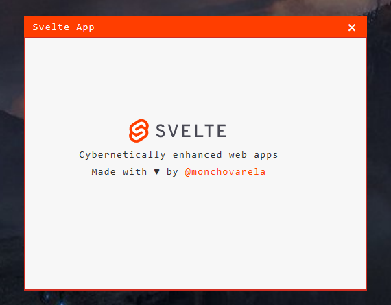

# Info

Basic Windows Desktop app made with [Pywebview](https://pywebview.flowrl.com/) & [Svelte](https://svelte.dev/).

## Screenshot

## Instructions

1º Clone Repo

2º Install dependencies

3º Create virtualenv `virtualenv env`

4º Activate `env\Scripts\activate`

5º Install Pywebview and Pyinstaller `(env)> pip install `

7º On Python terminal run Python main.py 

8º In other terminal run Svelte with `npm run dev`

9º On finish run `npm run build` and run `build.bat`

10º Copy assets on dist folder.

11º Voila!

**Pywebview** docs [here](https://pywebview.flowrl.com/)

**Svelte** docs [here](https://svelte.dev/)